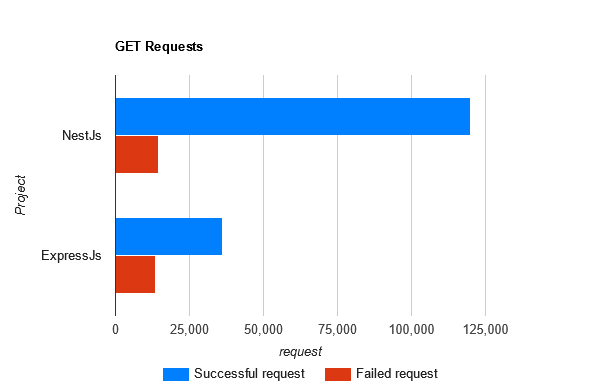

### **Báo cáo đánh giá hiệu năng của hai project NestJS và ExpressJS**

Báo cáo này đánh giá hiệu năng của hai project sử dụng `NestJS` và `ExpressJS`, dựa trên kết quả kiểm thử tải (**load test**) với các endpoint **POST** và **GET**.

Project `ExpressJS` là dự án gốc, không áp dụng tối ưu hóa.  
Trong khi đó, project `NestJS` đã được tối ưu hóa với:
- Caching theo mô hình cache-aside, giới hạn tần suất (**rate limiting**) cho cả **GET** và **POST** request.
- Bổ sung các tính năng bảo mật và xác thực (**validation**) cho **POST** request.

---

### Kết quả kiểm thử với POST

| Chỉ số                      | NestJS      | ExpressJS    |
| --------------------------- | ----------- | ------------ |
| **Độ trễ trung bình**       | 153.03 ms   | 51.72 ms     |
| **Số req/s trung bình**     | 65.54 req/s | 191.15 req/s |
| **Bytes/Second trung bình** | 20.6 kB     | 44.2 kB      |
| **Tổng số Requests**        | 4,000       | 11,000       |
| **Tổng số Data đã đọc**     | 1.24 MB     | 2.65 MB      |

#### **Phân tích**

- **Độ trễ:**
    Project `NestJS` có độ trễ cao hơn (trung bình 153.03 ms) so với `ExpressJS` (51.72 ms). Nguyên nhân là do các tính năng bảo mật và xác thực bổ sung trong `NestJS` khiến thời gian xử lý tăng lên.
    
- **Thông lượng:**
    `ExpressJS` xử lý số lượng yêu cầu mỗi giây cao gấp gần 3 lần so với `NestJS`. Điều này cho thấy các tính năng bảo mật và xác thực phía `NestJS` tạo ra một độ trễ đáng kể.
    
---

### Kết quả kiểm thử với GET

| Chỉ số                        | NestJS         | ExpressJS    |
| ----------------------------- | -------------- | ------------ |
| **Độ trễ trung bình**         | 3.93 ms        | 11.59 ms     |
| **Số req/s trung bình**       | 2,241.35 req/s | 827.54 req/s |
| **Bytes/Second trung bình**   | 771 kB         | 273 kB       |
| **Tổng số Requests**          | 134,000        | 50,000       |
| **Số lượng Request thất bại** | 14,460         | 13,390       |
| **Tổng số Data đã đọc**       | 46.3 MB        | 16.4 MB      |

#### **Phân tích**

- **Độ trễ:**  
    `NestJS` vượt trội trong xử lý **GET** request, với độ trễ trung bình là 3.93 ms so với 11.59 ms của `ExpressJS`. Cho thấy cơ chế caching trong `NestJS` phát huy hiệu quả trong việc giảm độ trễ.
    
- **Thông lượng:**  
    `NestJS` xử lý số lượng req/s cao hơn gấp đôi so với `ExpressJS`, chứng minh khả năng xử lý khối lượng công việc lớn cho các thao tác đọc dữ liệu.
    
---

### **Phân tích các Request lỗi**

|                       | NestJS  | ExpressJS |
| --------------------- | ------- | --------- |
| **2xx Responses**     | 124,000 | 47,262    |
| **Non-2xx Responses** | 14,460  | 13,390    |

#### **Quan sát**

- Cả hai project đều có số lượng đáng kể các **Non-2xx Responses**, có thể do giới hạn tần suất (**rate limiting**), lỗi xác thực, hoặc vấn đề từ phía server.

---

### **Tóm tắt**

| Chỉ số                         | Winner    | Nhận xét chính                                                                       |
| ------------------------------ | --------- | ------------------------------------------------------------------------------------ |
| **Độ trễ trung bình của POST** | ExpressJS | Nhanh hơn do không có xử lý bổ sung phức tạp (Bảo mật và xác thực).                  |
| **Thông lượng của POST**       | ExpressJS | Xử lý được nhiều req/s hơn do không có xử lý bổ sung phức tạp (Bảo mật và xác thực). |
| **Độ trễ trung bình của GET**  | NestJS    | Tối ưu hơn nhiều do có sử dụng cache-aside.                                          |
| **Thông lượng của GET**        | NestJS    | Xử lý tốt với khối lượng lớn các thao tác đọc dữ liệu.                               |

---

### **Kết luận**

1. **NestJS:**
    - Xử lý tốt số lượng lớn các **GET** request.
    - Có thêm các biện pháp bảo mật và xác thực.
2. **ExpressJS:**
    - Hiệu năng của **POST** có thể vượt trội hơn nhưng đổi lại không có thêm các lớp bảo mật và xác thực.
    - **GET** request kém hiệu quả hơn nhiều so với **NestJS** do không có các biện pháp tối ưu.